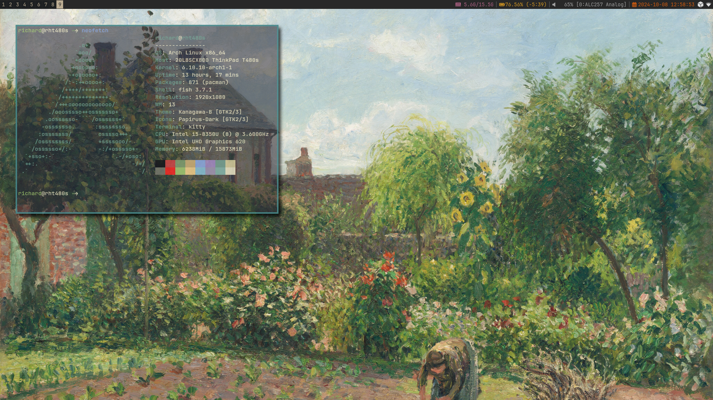

# My Linux Configuration

## Base
- Distro: Arch Linux
- Shell: fish
- Window Manager: i3
## Notable files & directories
- `.config` stores configurations for most of the software I use on a regular basis.
- `.local/share/applications` stores custom desktop application launchers.
- `.themes` stores GTK themes.
- `bin` stores custom scripts I use to manage my system.
- `packages.txt` is a list of packages installed on my computer.
## Yapping
I've been on and off Linux for a few years, mostly sticking to Ubuntu-based distros. As a summer project for 2024, I decided to dive into Arch Linux with a minimal window manager to create a personalised operating system for myself. I use these files on my main laptop and have mostly settled on my setup. Creating this helped me learn about:
- packages and package managers
- desktop environments
- common CLI applications
- installing a minimal linux distro from the command line
- file versioning
- bash scripting
- and more.
